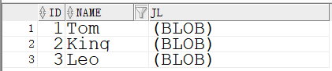
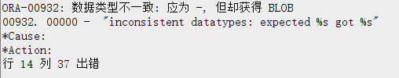
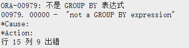
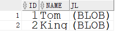

> # 关于oracle中以Blob字段查找重复值问题


## 问题产生
最近在工作当中有个统计问题，统计Oracle数据库里面人员表中简历一致的人的有哪些。很明显，就是查重嘛。说到查重，当然想到就是Group by方法。
## 库表结构（简单的还原一下库表）

```sql
create table cs(
id int PRIMARY KEY not null,
name NVARCHAR2(50) not null,
jl blob not null
);
select * from cs;
insert into cs  select 1,'Tom',to_blob('123412f') from dual;
insert into cs  select 2,'King',to_blob('123412f') from dual;
insert into cs  select 3,'Leo',to_blob('124123F21F') from dual;
```

## 操作
### 1.通过Group by 方式进行查重（操作失败）
遇到这个问题，我熟啊！写group by语句就行了呗，然后就写了这样的语句
```sql
select  jl,count(1) from cs group by jl having count(1)>1;
```
当我美滋滋开始执行的时候，却出现的问题

查了查相关资料知道了，oralce是不能通过blob类型的字段进行group by的，那我把这个字段用to_char()转换一下试试看
```sql
select jl,count(1) from cs group by to_char(jl) having count(1)>1;
```

显然，group by 也不能后跟to_char()函数。那我只能是自己写语句吧。
### 2.自己写语句查重
如果不能用group by 进行查重的话，只能是自己写查重语句，然后就写了如下语句
```sql
select * from cs t1 where exists (select 1 from cs t2 where to_char(t2.jl) = to_char(t1.jl) and t2.id !=t1.id);
```
需要注意的是blob类型字段是不能直接=，需要to_char()转换，这个语句就执行成功了。结果如下，问题解决。
