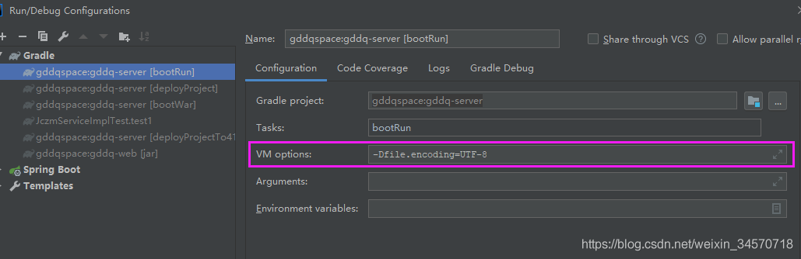
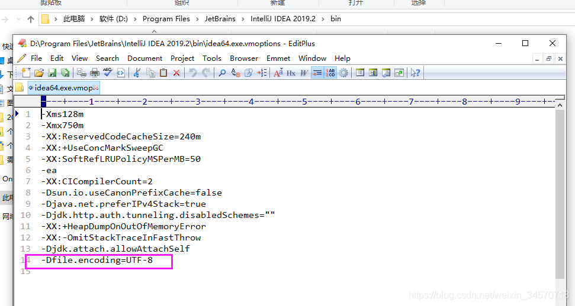
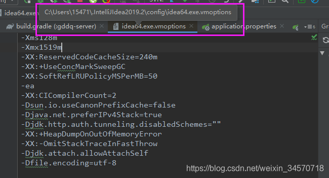

> # IDEA控制台乱码问题

## 问题产生

最近公司项目翻新，新项目开发摒弃了eclipse，使用IDEA开发工具。在调试的时候发现控制台中文出现了乱码问题。

## 可能的原因

### 1.启动服务器的VM options设置（第一次尝试解决，未成功）

IDEA控制台出现乱码，常规套路应该是启动的服务器没有设置VM OPTION的问题。于是找到使用的服务器，Edit configurations，如图所示：

在VM options 中，添加 -Dfile.encoding=UTF-8。重新RUN服务器，发现没有解决问题。

### 2.IDEA启动时的设置问题（第二次尝试解决，未成功）

如果设置过启动服务器VM options还是不行，查了查百度，可能是和IDEA客户端启动时的设置有关系，即在安装位置中的idea.exe.vmoptions或idea64.exe.vmoptions。于是找到IDEA安装的位置，找到这俩文件，在文件中添加 -Dfile.encoding=UTF-8，如图所示：

重启IDEA，之后运行服务器，乱码问题仍存在。

### 3.通过IDEA自带的功能设置Custom VM options（第三次尝试，问题解决）

IDEA自带对客户端的VM options的设置，在Help->Edit Custom VM options 中，点击之后出现idea64.exe.vmoptions文件，添加一下 -Dfile.encoding=UTF-8，重启一下IDEA即可。

问题解决！

## 总结

方法2和方法3其实是一样的，为什么方法2没有奏效，是因为我找到的idea64.exe.vmoptions文件并不是IDEA客户端启动时用的文件。而Help中设置Custom VM options找到的文件才是真正启动的时候用的idea64.exe.vmoptions文件，如图所示：

真正的启动文件是在C盘下某个安装的目录中，并非idea客户端安装的地方。

