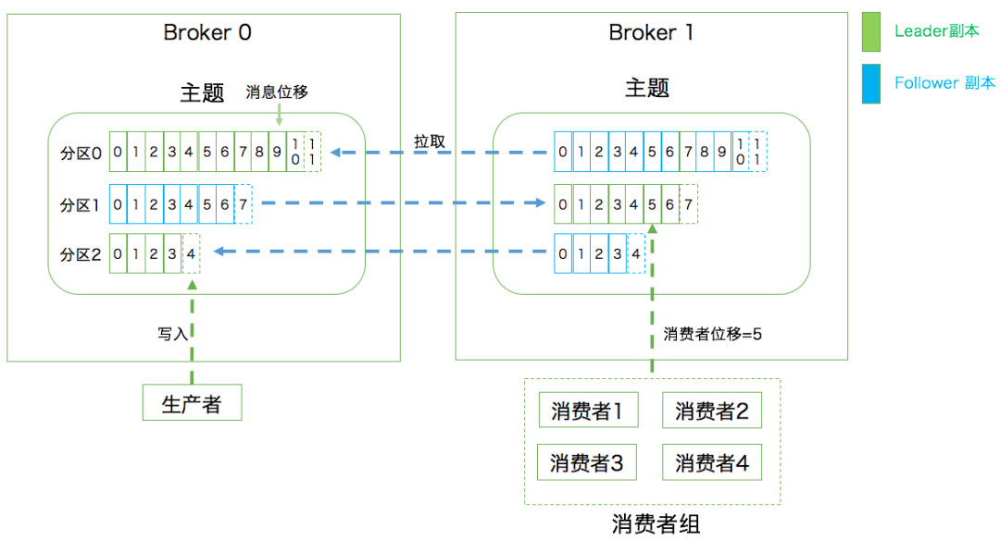

> # Kafka深入浅出


Kafka 服务器端的代码是由 Scala 代码编写，支持面向对象编程和函数式数据，编译过后也是普通的 .class 文件。其的作用：提供统一的、高吞吐量、低延迟的平台来处理实时数据

# 一、基本概念

## 「Kafka 是什么？主要应用场景什么？」

Kafka 是一个分布式流式处理平台。




**1 . 主题**：发布订阅的对象是主题（Topic），可以为每个业务、每个应用甚至每类数据都创建专属的主题


**2 . 生产者和消费者**：向主题发布消息的客户端应用程序成为生产者，生产者程序通常持续不断地向一个或者多个主题发送消息


**3 . Broker**：集群由多个 Broker 组成，Broker 负责接收和处理客户端发送过来的请求，以及对消息进行持久化。

	虽然多个 Broker 能够运行在同一台机器上，但是常见的做法是将不同的 Broker 分散运行在不同的机器上，这样如果某一台机器宕机，即使在它上面运行的所有 Broker 进程都挂掉了，其他机器上的 Broker 也一眼能够对外提供服务。


 **4 . 备份机制**：备份的思想很简单，就是把相同的数据拷贝到多台机器上，而这些相同的数据拷贝被称为副本。

	Kafka 定义了两类副本：领导者副本和追随者副本。

	前者对外提供服务，即与客户端程序进行交互；后者只是被动地追随领导者副本而已，不对外进行交互。


**5 . 分区**：分区机制指的是将每个主题分成多个分区，每个分区是一组有序的消息日志

	生产者生产的每条消息总会被发送到一个分区中，也就是说如果向一个双分区的主题发送一条消息，该条消息要不在分区 0 中，要不在分区 1 中。

	生产者向分区中写入消息，每条消息在分区中的位置信息叫做位移。


**6 . 消费者组**：多个消费者实例共同组成一个组来消费一组主题

	这组主题中的每个分区只会被组内的一个消费者实例消费，其他消费者实例不能消费它

	消息引擎的两大模型：

		如果所有实例都属于同一个 Group，那么它实现的就是消息队列模型

		如果所有实例属于不同的 Group，那么它实现的就是发布/订阅模型

> **RocketMQ 的消息模型和 Kafka 基本是完全一样的。唯一的区别是 Kafka 中没有队列这个概念，与之对应的是 Partition（分区）。**


**7 . Coordinator：协调者**：负责为 Group 执行 Rebalance 以及提供唯一管理和组成员管理等。


**8 . 消费者位移：Consumer offset**：消费者消费进度，每个消费者都有自己的消费者位移


**9 . 重平衡：Rebalance**：消费者组内某个消费者实例挂掉后，其他消费者实例自动重新分配订阅主题分区的过程。

Rebalance 是 Kafka 消费者端实现高可用的重要手段


**10 . AR（Assigned Replicas）**：分区中的所有副本统称为 AR。

所有消息都会先发送到领导者副本，然后追随者副本才能从领导者中拉去信息进行同步

但是同步期间，追随者副本相对于领导者副本而言有一定程度的滞后，这时候追随者副本和领导者副本并非完全同步状态


**11 . OSR（Out Sync Replicas）**：AR 的一个子集，其中都是追随者副本和领导者副本没有完全同步或者之后的副本集合


**12 . ISR（In Sync Replicas）**：AR 的一个子集，ISR 中的副本都是和领导者副本是保持完全同步的副本。

如果某一个在 ISR 中的 follower 副本落后于 leader 副本太多，就会从 ISR 中移除，否则如果完全同步，会从 OSR 中移到 ISR 集合中


**13 . HW（High Watermark）**：高水位，标识一个特定的消息偏移量（offset），消费者只能来取这个水位 offset 之前的消息

下图表示一个日志文件，这个日志文件中只有9条消息，第一条消息的offset（LogStartOffset）为0，最有一条消息的offset为8，offset为9的消息使用虚线表示的，代表下一条待写入的消息。

日志文件的 HW 为6，表示消费者只能拉取offset在 0 到 5 之间的消息，offset为6的消息对消费者而言是不可见的。

![[ce77dd7ccc11dc7642aad16560000cb9_MD5.png]](img/ce77dd7ccc11dc7642aad16560000cb9_MD5.png)


**14 . LEO（Log End Offset）**：标识当前日志文件中下一条待写入的消息的offset

# 二、系统架构

Kafka 基础框架：一个生产者发送一个消息到 Kafka 的一个 Topic，该 Topic 的消息存放在 Broker 中，消费者订阅这个 Topic，然后从 Broker 中消费消息。


1.**消息状态**：在 Kafka 中，消息是否被消费的状态保存在消费者中，Broker 不会关系消息是否消费，或者被谁消费，消费者会记录一个 offset 值（指向分区中下一条被消费的消息位置），如果 offset 被错误设置可能会导致同一条消息多次消费或者丢失。

2.**消息持久化**：Kafka 会把消息持久化到本地文件系统中，并且具有极高的性能。

3.**批量发送**：Kafka 支持以消息集合为单位进行批量发送，以提高效率。

4.**Push-and-Pull**：Kafka 中的生产者和消费者采用的是 Push-and-Pull 模式，即生产者向 Broker Push 消息，消费者从 Broker Pull 消息。

5.**分区机制**：Kafka 的 Broker 是支持分区的，Producer 可以决定将消息放在哪个 Partition，在一个 Partition 中的消息顺序就是 Producer 发送消息的顺序，一个 Topic 中的 Partition 是可以配置的，Partition 是保证 Kafka 高吞吐量的重要保证。

![[68d9aaa9dd34dbc9d516201de1f2ab55_MD5.png]](img/68d9aaa9dd34dbc9d516201de1f2ab55_MD5.png)

通常情况下，一个 Kafka 体系是包含多个 Producer，多个 Broker，多个 Consumer，以及一个 Zookeeper 集群

# 三、生产者分区

一条 Kafka 消息的的组织架构是三层：主题（Topic）- 分区（Partition）- 消息（Message）

分区其实是一种负载均衡的做法。因为同一个 Topic 下的不同分区可以在不同 Broker 节点上，并且，数据读写是以分区为粒度，这样的话，每个节点都可以执行自己分区的消息的读写。除此之外，还能通过增加节点来提高吞吐量。

## 「分区策略」

所谓的分区策略其实就是决定生产者将消息发送到哪个分区的算法。

### 自定义分区策略

如果需要自己定义分区策略，在编写生产者程序的时候，可以编写一个具体的实现类`org.apache.kafka.clients.producer.Partitioner` 接口。这接口也非常简单，只定义了两个方法：partition() 和 close() 方法。通常情况我们只需要实现 partition() 方法即可。

```java
int partition(String topic, Object key, byte[] keyBytes, Object value, byte[] valueBytes, Cluster cluster);
```

这里的 topic、key、keyBytes、value 和 valueBytes 都属于消息数据，cluster 则是集群信息（比如当前 Kafka 集群共有多少主题、多少 Broker 等）。

### 轮询策略

也称 Round-robin 策略，即顺序分配。轮询策略是 Kafka 生产者 API 默认提供的分区策略。

轮询策略有非常优秀的负载均衡表现，它总是保证消息最大限度的平均分配到所有的分区上，所以默认下它是最合理的分区策略，也是最常用的分区策略。

### 随机策略

也称 Randomness 策略。想要实现随机策略的 partition 方法，其实很简单，只需要两行代码即可：

```java
 List partitions = cluster.partitionsForTopic(topic);
 return ThreadLocalRandom.current().nextInt(partitions.size());

```

先计算出该主题的总分区数，然后随机返回一个小于它的正整数。

随机策略在负载均衡上面略逊于轮询策略。在老的版本里面常用随机策略，再后来的版本更新中被轮询策略所替代。

### 按消息键保序策略

Kafka 允许为每条消息定义消息键，简称 Key。

Key 可以为具体的业务代码，也可以用来表征消息元数据。在 Kafka 中如果消息定义了 Key，那么就可以保证同一个 Key 的消息进入相同的分区，有序分区下的消息处理是有顺序的，所以这个策略被称为安消息键保存策略。

实现这个策略的 partition 方法同样简单，只需要下面两行代码即可：

```java
 List partitions = cluster.partitionsForTopic(topic);
 return Math.abs(key.hashCode()) % partitions.size();
```

其实，Kafka 默认的分区策略是两种：
	如果指定了 Key ，默认实现按消息键保序策略；
	如果未指定 Key，则使用轮询策略。

### 「其他分区策略」

另外还有一种比较常见的，所谓的基于地理位置的分区策略。当然这种策略只针对大规模的 Kafka 集群，特别是跨城市、跨国家甚至是跨大洲的集群。我们可以根据 Broker 所在的 IP 地址实现定制化的分区策略。比如下段代码：

```java
List partitions = cluster.partitionsForTopic(topic);
return partitions.stream().filter(p -> isSouth(p.leader().host())).map(PartitionInfo::partition).findAny().get();
```

我们可以从所有分区中找出那些 Leader 副本在南方的所有分区，然后随机挑选一个进行消息发送。

# 四、生产者压缩算法

为什么要压缩消息？压缩消息是为了更好的节省网络传输贷款以及 Kafka Broker 端的磁盘占用。

### 「Kafka 是如何压缩消息的呢？」

Kafka 的消息层次分为两层：消息集合和消息。

??？

### 「何时压缩？」

在 Kafka 中，压缩可能发生在两个地方：生产者端和 Broker 端。

在生产者程序中配置 compression.type 参数即表示弃用指定类型的压缩算法。

比如这段代码中展示了如何构建一个开启 GZIP 的 Producer 对象：

```java
Properties props = new Properties();
props.put("bootstrap.servers", "localhost:9092");
props.put("acks", "all");
props.put("key.serializer", "org.apache.kafka.common.serialization.StringSerializer"); props.put("value.serializer", "org.apache.kafka.common.serialization.StringSerializer"); // 开启GZIP压缩
props.put("compression.type", "gzip"); //Producer的压缩算法是GZIP
Producer producer = new KafkaProducer<>(props);
```

这样 Producer 启动之后生产的每个消息集合都是经 GZIP 压缩过的，故而能很好的节省网络传输贷款以及 Kafka Broker 端的磁盘占用。

有两种情况可能导致 Broker 重新压缩消息：

- 情况一：Broker 端指定了和 Producer 端不同的压缩算法。

一旦 Broker 端设置了不同的 compression.type 值，就一定要小心了，因为可能会发生预料之外的压缩、解压缩操作，通常表现为 Broker 端 CPU 使用率飙升。

- 情况二：Broker 端发生了消息格式转换。

所谓的消息格式转换主要是为了兼容老版本的消费者程序。在一个生产环境中，Kafka 集群中同时保存多个版本的消息格式非常常见。为了兼容老版本的格式，Broker 端会对新版本消息指向向老版本的转换。这个过程会涉及到消息的解压缩和重新压缩。一般情况下这种消息格式转换成对性能是有很大影响的，除了这里的压缩之外，他还让 Kafka 丧失了 Zero Copy 特性。

### 「何时解压缩？」

有压缩必有解压缩！通常来说解压缩发生在消费者程序中。

**基本过程：Producer 端压缩，Broker 端保持，Consumer 端解压缩。**

注意：除了在 Consumer 端解压缩外，Broker 端也会进行解压缩。

每个压缩过的消息集合在 Broker 端写入时都要发生解压缩操作，目的就是为了对消息执行各种验证。我们必须承认这种解压缩对 Broker 端性能有一定的影响，特别是对 CPU 的使用率而言。

### 「各种压缩算法对比」

Kafka 支持 4 种压缩算法：GZIP、Snappy 、LZ4 和 zstd(Zstandard 算法)。在实际使用中，各个算法各有千秋。

吞吐量：LZ4 > Snappy > zst 和 GZIP；

压缩比：zstd > LZ4 > GZIP > Snappy；

占用宽带：zstd < LZ4 和 GZIP < Snappy；

在CPU使用率方面，各个算法表现得差不多，只是在压缩时Snappy算法使用的CPU较多一些，而在解压缩时GZIP算法则可能使用更多的CPU。

# 五、消费者组

Consumer Group 是 Kafka 提供可拓展且具有容错性的消费机制。

既然是一个组，那么组内必然是可以有多个消费者或者消费者实例，它们共享一个公共的 ID，这个 ID 被称为 Group ID。组内所有的消费者协调在一起来消费订阅主题的所有分区。每个分区只能有同一个消费组内的一个 Consumer 实例来消费。

### Consumer Group 三个特性

1.Consumer Group 下可以有一个或者多个 Consumer 实例，这里的实例可以是一个单独的进程，也可以是同一个进程下的线程。

2.Group ID 是一个字符串，在一个 Kafka 集群中，它表示唯一的一个 Consumer Group。

3.Consumer Group 下所有实例订阅的主题的单独分区，只能分配给组内的某个 Consumer 实例消费，这个分区当然也可以被其他的 Group 消费。

Kafka 仅仅使用 Consumer Group 这一种机制，却同时实现了传统消息引擎系统的两大模型：

- 如果所有实例都是属于同一个 Group，那么它实现的是消息队列模型；

- 如果所有实例分别属于不同的 Group，那么它实现的就是发布/订阅模型。

### 一个 Group 下应该有多少个 Consumer 实例呢？

理想情况下，Consumer 实例的数量应该等于 Group 订阅主题的分区总数。

> 假设一个 Comsumer Group 订阅了 3 个主题，分别是 A、B、C，它们的分区数分别是 1，2，3，那么通常情况下，为改 Group 设置 6 个 Consumer 实例是比较理想的情形，因为它能最大限度的视线高伸缩性。


### 针对 Consumer Group，Kafka 是怎么管理位移呢？

老版本 Consumer Group 把位移保存在 ZooKeeper 中。Apache ZooKeeper 是一个分布式的协调服务框架，Kafka 重度依赖它实现的各种各样的协调管理。将唯一保存到 ZooKeeper 外部系统的做法，最显而易见的好处就是减少了 Kafka Broker 端的状态保存开销。

但是，慢慢的发现一个问题，即 ZooKeeper 这类元框架其实并不适合进行频繁的写更新，而 Consumer Group 的位移更新是一个非常频繁的操作。这种大吞吐量的写操作会极大拖慢 ZooKeeper 集群的性能。于是，新版本的 Consumer Group 中，Kafka 社区重新设计了 Consumer Group 的位移管理方式，采用将位移保存在 Kafka 内部主题的方法。

这个内部主题就是\_counsumer_offset.

# 六、消费者策略

消费者消费同一主题的哪个分区，是通过消费者策略决定的。

#### 轮询 Round

Kakfa 默认的消费者策略——轮询，通过轮询方式，决定消费者消费的分区。

![[2ca562d1dc3a2d8d06c7c2bfe2c394c8_MD5.png]](img/2ca562d1dc3a2d8d06c7c2bfe2c394c8_MD5.png)

#### 范围计算 Range

对一个消费者组来说，决定消费方式是以分区总数除以消费者总数来决定，一般如果不能整除，往往是从头开始将剩余的分区分配开

![[c3276b5f713b8b0641463b496c196ce2_MD5.png]](img/c3276b5f713b8b0641463b496c196ce2_MD5.png)

#### 范围计算升华版 Sticky

是在0.11.x，新增的，它和前面两个不是很一样，它是在Range上的一种升华，且前面两个当同组内有新的消费者加入或者旧的消费者退出的时候，会从新开始决定消费者消费方式，但是Sticky，在同组中有新的新的消费者加入或者旧的消费者退出时，不会直接开始新的Range分配，而是保留现有消费者原来的消费策略，将退出的消费者所消费的分区平均分配给现有消费者，新增消费者同理，同其他现存消费者的消费策略中分离。

# 七、位移提交

假设一个分区中有 10 条消息，唯一分别是 0 到 9.

某个 Consumer 应用已经消费了 5 条消息，这就说明该 Consumer 消费了位移为 0 到 4 的 5 条消息，此时 Consumer 的位移是 5，指向了下一条消息的位移。因为 Consumer 能够同时消费多个分区的数据，所以位移的提交实际上是在分区粒度上进行的，即 **Consumer 需要为分配给它的每一个分区提交各自的位移数据。**

位移提交分为自动提交和手动提交；从 Consumer 端的角度来说，位移提交分为同步提交和异步提交。

开启自动提交位移的方法：Consumer 端有一个参数 `enable.auto.commint`，把它设置为 true 或者不设置它即可。

如果开启了自动提交，Consumer 端还有个参数：`auto.commit.interval.ms`。默认为 5 秒，表明 Kafka 每 5 秒会自动提交一次位移。

```java
Properties props = new Properties();
props.put("bootstrap.servers", "localhost:9092");
props.put("group.id", "test");
//开启自动提交
props.put("enable.auto.commit", "true");
//自动提交时间间隔
props.put("auto.commit.interval.ms", "2000");
props.put("key.deserializer", "org.apache.kafka.common.serialization.StringDeserializer");
props.put("value.deserializer", "org.apache.kafka.common.serialization.StringDeserializer");
KafkaConsumer consumer = new KafkaConsumer<>(props);
consumer.subscribe(Arrays.asList("foo", "bar"));
while (true) {
    ConsumerRecords records = consumer.poll(100);
    for (ConsumerRecord record : records)
        System.out.printf("offset = %d, key = %s, value = %s%n", record.offset(), record.key(), record.value());
}
```

如果要开启手动提交，只需要将 `enable.auto.commit` 设置为 `false` 即可。

手动提交需要调用相应的 API 手动提交位移。最简单的 API 就是 `KafkaConsumer#commitSync()` 。该方法会提交 `KafkaConsumer#poll()` 返回的最新位移。从名字上来看，这是一个同步方法，即该方法会一直等待，直到位移成功提交之后才会返回。如果提交过程中出现异常，该方法会将异常信息抛出。

下面这段代码展示了 commitSync() 的使用方法：

```java
while (true) {
        ConsumerRecords records =consumer.poll(Duration.ofSeconds(1));
        process(records); // 处理消息
        try {
            consumer.commitSync();
        } catch (CommitFailedException e) {
            handle(e); // 处理提交失败异常
        }
}
```

自动提交时，Kafka 会保证再开始调用 poll 方法时候，提交上次 poll 方法返回的所有消息。从顺序上来说，poll 方法的逻辑是先提交上一批消息的位移，然后在处理下一批消息，因此，自动提交能保证不会出消费丢失的情况。但是自动提交位移的问题在于，**可能出现重复消费。**

手动提交的好处在于更加灵活，可以完全把控位移提交的时机和频率。但是他也有一个缺陷，就是在调用 `commitSync()` 时候会处于阻塞状态，直到远端 Broker 返回提交结果，这个状态才能结束。

这时候，手动提交的另一个方法就出现了 `KafkaConsumer#commitAsync()`。从名字上看，这是个异步操作。调用 `commitAsync()` 方法之后，它会立即返回，不会阻塞，因此不影响 Consumer 应用的 TPS（吞吐量）。由于它是异步的，Kafka 提供了一个回调函数（callback），供开发者实现提交之后的逻辑，比如记录日志或处理异常。

下面这段代码展示了调用 commintAsync() 方法：

```java
while (true) {
            ConsumerRecords records = consumer.poll(Duration.ofSeconds(1));
            process(records); // 处理消息
            consumer.commitAsync((offsets, exception) -> {
				 if (exception != null)
					 handle(exception);
			});
}
```

commitAsync 的问题在于，出了问题时它不会重试。

显然，如果手动提交，我们需要将 commitSync 和 commitAsync 组合使用才能达到最理想的效果：
	1.我们可以利用 commitSync 的自动动重试来规避那些瞬时错误，比如网络的瞬时都懂，Broker 端的 GC 问题，因为这些问题是短暂的，自动重试通常都会成功。
	2.我们不希望程序总是处于阻塞状态，影响 TPS。

我们来看一下下面这段代码，它展示的是如何将两个 API 方法结合使用进行手动提交。

```java
try {
    while(true) {
        ConsumerRecords records = consumer.poll(Duration.ofSeconds(1));
        process(records); // 处理消息
        commitAysnc(); // 使用异步提交规避阻塞
    }
} catch(Exception e) {
        handle(e); // 处理异常
} finally {
      try {
        consumer.commitSync(); // 最后一次提交使用同步阻塞式提交
} finally {
 		consumer.close();
}
}
```

试想这样一个场景：poll 方法返回的不是 500 条消息，而是 5000 条。

那么，你肯定不想把这 5000 条消息处理完之后再提交位移，因为一旦中间出差错，之前处理的全部都要重来一遍。那么我们可以每处理完 100 条消息就提交一次位移，这样避免大批量的消息重新消费。

Kafka Consumer API 为手动提交提供了这样的方法：`commitSync(Map)` 和 `commitAsync(Map)`。它们的参数是一个 Map 对象，键就是 TopicPartition，即消费的分区，而值是一个 OffsetAndMetadata 对象，保存主要是位移数据。

以 commitAsync 为例，展示一段代码。实际上，commitSync 的调用方法和它一模一样的。

```java
private Map offsets = new HashMap<>();
int count = 0;
……
while (true) {
    ConsumerRecords records = consumer.poll(Duration.ofSeconds(1));
        for (ConsumerRecord record: records) {
            process(record);  // 处理消息
            offsets.put(new TopicPartition(record.topic(), record.partition()),new OffsetAndMetadata(record.offset() + 1)；
            if（count % 100 == 0）
                consumer.commitAsync(offsets, null); // 回调处理逻辑是null
                count++;
 }
}
```

与调用无参的 commitAsync 不同，这里调用了带 Map 对象参数的 commitAsync 进行细粒度的位移提交。

# 八、重平衡

重平衡 Rebalance 本质上是一种协议，规定了一个 Consumer Group 如何分配订阅 Topic 的每一个分区。Kafka 在为 Consumer Group 内的 Consumer 分配分区的过程，就是 Rebalance。

Rebalance 触发条件有三个：

- 组内成员发生变化，即有新的 Consumer 实例加入组或者离开祖，或者因崩溃而退出组。

- 订阅主题数发生变化，Consumer Group 可以通过正则表达式方式订阅主题，比如 `consumer.subscribe(Pattern.compile("t.*c"))` 就表明 Group 订阅所有以字母 t 开头、字母 c 结尾的主题，所以在 Consumer Group 运行过程中，如果创建了满足要求的主题，就会发生 Rebalance。

- 订阅主题的分区发生变化，Kafka 当前只能允许增加一个主题的分区数，当主题的分区数发生变化，就会触发该主题下所有 Group 的 Rebalance。

### 「分配策略」

当前Kafka默认提供了3种分配策略，每种策略都有一定的优势和劣势，社区会不断地完善这些策略，保证提供最公平的分配策略，即每个Consumer实例都能够得到较为平均的分区数。


### 「Coordinator 会在什么情况下确认 Consumer 实例挂掉了从而要退组？」

在 Consumer Group 完成 Rebalance 之后，每个 Consumer 实例都会定期的想 Coordinator 发送心跳请求，表明它还活着。如果某个 Consumer 不能及时的发送心跳请求，娜美 Coordinator 就会认为它已经死了，从而将其从 Group 中移除，然后开启新一轮的 Rebalance。

Consumer 端设置参数里面有个：`session.timeout.ms`。默认为 10 秒，即如果 Coordinator 在 10 秒内没有收到 Group 的某个 Consumer 的心跳请求，则认为它已经挂了。除了这个参数，还有个允许开发者控制发送心跳的频率的参数，就是 `heartbeat.interval.ms`。这个参数设置越小，Consumer 发送心跳请求的频率越高。当然，请求频率越高，消耗的带宽资源也就越高。

除此之外，Consumer 端还有个参数，用于控制 Consumer 实际消费能力对对 Rebalance 的影响，即：`max.pool.interval.ms` 参数。它限定了 Consumer 端应用程序两次调用 poll 方法的最大时间间隔。默认值为 5 分钟，表示如果 Consumer 在 5 分钟内没有消费完 poll 方法返回的消息，那么 Consumer 会主动发起离开 Group 的请求，Coordinator 则会开启新的 Rebalance。

### 「如何设置避免 Rebalance」

1. 如果是因为未能及时发送心跳请求，导致 Consumer 被踢出 Group ，引发的 Rebalance。则可以设置 `session.timeout.ms` 和 `heartbeat.interval.ms` 的值。

	- 设置 `session.timeout.ms` = 6s。

	- 设置 `heartbeat.interval.ms` = 2s。

	- 要保证 Consumer 实例在被判定为 dead 之前，能够发送 3 条心跳请求，即 `session.timeout.ms >= 3 * heartbeat.interval.ms`。

将 `session.timeout.ms` 设置为 6s 主要是为了让 Coordinator 能更快定位已经挂掉的 Consumer。

2. 如果是因为 Consumer 消费时间过长导致的 Rebalance。在开发过程中，为业务逻辑处理留足充足的时间，这样 Consumer 就不会因为处理这些消息太长而引起 Rebalance 了。

# 九、ConsumerOffsets

`_consumer_offsets` 是一个 Kafka 的普通主题，它主要是保存 Kafka Consumer 的位移信息。当 Kafka 中的第一个 Consumer 启动时候，就会创建该主题。其默认分区数是 50，副本数是 3。`_consumer_offsets` 主题是一个普通的 Kafka 主题，开发者可以手动的创建、修改甚至删除它。但是它的消息格式是 Kafka 自己定义的，不能修改。开发者只能按照规定传入消息，否则内部不能成功解析，就会导致 Broker 崩溃。

`_consumer_offsets` 有 3 中消息格式：

- 用于保存 Consumer Group 信息的消息。

- 用于删除 Group 过期位移甚至删除 Group 的消息。

- 保存了位移值。

前面已经提到过，Kafka 的提交方式有两种：自动提交和手动提交。

手动提交：比较灵活可控，通过调用 `commitSync()` 或者 `commitAsync()` 等 Kafka Consumer 的 API，Kafka 会向 `_consumer_offsets` 主题中写入相应的消息。

自动提交：显著优点就是省事，不用操心位移提交的事情，就能保证消息不会丢失。但是自动提交位移的有个问题，只要 Consumer 一直启动着，它就会无限期的向位移主题写入消息。

> 假设Consumer当前消费到了某个主题的最新一条消息，位移是100，之后该主题没有任何新消息产生，故Consumer无消息可消费了，所以位移永远保持在100。由于是自动提交位移，位移主题中会不停地写入位移=100 的消息。显然 Kafka 只需要保留这类消息中的最新一条就可以了，之前的消息都是可以删除的。


显然，Kafka 必须要有针对位移主题消息特点的消息删除策略，否则这种消息越多，最重撑爆整个磁盘

### 「Compact 策略」

Kafka 通过 Compact 策略来删除 `_consumer_offsets` 主题中的过期消息，避免该主题无限膨胀。Compact 的过程就是扫描日志的所有消息，剔除过期消息，把剩下消息整理在一起。

Kafka 提供了专门的后台线程定期的巡检待 Compact 的主题，看看是否存在猫族条件的可删除数据。这个后台线程叫做 **Log cleaner**。如果生产环境中出现了位移主题无限膨胀占用过多磁盘空间问题，请检查一下 Log cleaner 线程是否挂掉了。

# 十、副本机制

根据 Kafka 副本机制定义，同一个分区下面的所有副本保存有相同的消息队列，这些副本是分布在不同 Broker 中，以确保某个 Broker 宕机后其他副本可以正常使用。

在 Kafka 中，副本分为领导者副本和追随者副本。其中追随者副本不参与什么读写请求操作。追随者副本只异步拉去领导者副本，在领导者副本所在的 Broker 宕机的时候，重新从追随者副本中推选出一个领导者副本。

追随者副本唯一的工作就是，不断的从领导者副本中拉取消息，然后写入自己的提交日志中。

![[ff0fd5af97f5f5ad3a954f3ffa4076d0_MD5.png]](img/ff0fd5af97f5f5ad3a954f3ffa4076d0_MD5.png)

# 十一、ISR 机制

in-sync Replicas，也就是所谓的 ISR 副本集合。这个集合是动态的，而非静态不变。

ISR 中的副本一定是好 Leader 副本同步的，相反不在 ISR 中的副本一定是和 Leader 副本不同步的。

Leader 副本一定在 ISR 中，Follower 副本不一定在 ISR 中。在 Broker 端有个配置参数 `replica.lag.time.max.ms`，这个参数的含义是 Follower 副本落后 Leader 副本的时间不连续超过 10 秒，那么 Kafka 认为 Follower 副本和 Leader 是同步的，即使此时 Follower 副本中保存的消息明显少于 Leader 副本中的消息。

# 十二、Unclean 领导者选举

Kafka 将所有不在 ISR 中的副本都认为是非同步副本。在领导者选举的时候，如果选举这种副本的过程称为 Unclean 领导者选举。在 Broker 端中参数 `unclean.leader.election.enable` 控制是否开启 Unclean 领导者选举。

Unclean 领导者选举有利有弊。优点在于：因为一个分区中 Leader 副本负责读写请求，如果 Leader 副本挂了，整个分区就改了。开启 Unclean 领导者选取，会使 Leader 副本一直存在，不至于对外停止服务，提高了高可用；缺点在于：因为从 ISR 中选举 Leader 副本，就会出现数据不同步情况，就会导致数据丢失。

# 十三、副本选举

Kafka 在选取 Leader 副本时候，考虑到负载均衡的平衡性，会将不同的分区的 Leader 副本分配到不同的 Broker 中，这样既能避免 Broker 宕机导致多个分区不可用，也能平衡 Broker 的负载。

Kafka 引入了优先副本的概念，优先副本的意思是，在分区的所有 AR 集合列表中的第一个副本，理想状态下就是该分区的 Leader 副本。

例如kafka集群由3台broker组成，创建了一个名为 `topic-partitions` 的topic，设置partition为3，副本数为3，partition0中AR列表为 `[1,2,0]`，那么分区0的优先副本为1

![[882565aff441558b043b911c7c240f29_MD5.png]](img/882565aff441558b043b911c7c240f29_MD5.png)

当分区leader节点发生故障时，其中的一个follower节点就会选举为新的leader节点。当原来leader的节点恢复之后，它只能成为一个follower节点，此时就导致了集群负载不均衡。比如分区1的leader节点broker2崩溃了，此时选举了在broker1上的分区1follower节点作为新的leader节点。当broker2重新恢复时，此时的kafka集群状态如下：

![[d9e50eff06b436f7621152f2739a05c5_MD5.png]](img/d9e50eff06b436f7621152f2739a05c5_MD5.png)

可以看到，此时broker1上负载更大，而broker2上没有负载。

**「为了解决上述负载不均衡的情况，kafka支持了优先副本选举，优先副本指的是一个分区所在的AR集合的第一个副本」**。

比如上面的分区1，它的AR集合是`[2,0,1]`，表示分区1的优先副本就是在broker2上。

理想情况下，优先副本应该就是leader副本，kafka保证了优先副本的均衡分布，而这与broker节点宕机与否没有关系。

**「优先副本选举就是对分区leader副本进行选举的时候，尽可能让优先副本成为leader副本」**，针对上述的情况，只要再触发一次优先副本选举就能保证分区负载均衡。

kafka支持自动优先副本选举功能，默认每5分钟触发一次优先副本选举操作。

# 十四、网络通信模型

![[93681a72e52523561d8f052cb74d6da0_MD5.png]](img/93681a72e52523561d8f052cb74d6da0_MD5.png)

Broker 中有个`Acceptor(mainReactor)`监听新连接的到来，与新连接建连之后轮询选择一个`Processor(subReactor)`管理这个连接。

而`Processor`会监听其管理的连接，当事件到达之后，读取封装成`Request`，并将`Request`放入共享请求队列中。

然后IO线程池不断的从该队列中取出请求，执行真正的处理。处理完之后将响应发送到对应的`Processor`的响应队列中，然后由`Processor`将`Response`返还给客户端。

每个`listener`只有一个`Acceptor线程`，因为它只是作为新连接建连再分发，没有过多的逻辑，很轻量。

`Processor` 在Kafka中称之为网络线程，默认网络线程池有3个线程，对应的参数是`num.network.threads`，并且可以根据实际的业务动态增减。

还有个 IO 线程池，即`KafkaRequestHandlerPool`，执行真正的处理，对应的参数是`num.io.threads`，默认值是 8。

IO线程处理完之后会将`Response`放入对应的`Processor`中，由`Processor`将响应返还给客户端。

可以看到网络线程和IO线程之间利用的经典的生产者 - 消费者模式，不论是用于处理Request的共享请求队列，还是IO处理完返回的Response。

# 十五、幂等性

## **「幂等性Producer」**

在 Kafka 中，Producer 默认不是幂等性的，但是我们可以创建幂等性 Producer。`enable.idempotence` 设置为 True，即可保证 Producer 自动升级成幂等性 Producer，其他所有的代码逻辑都不需要更改。配置后，Kafka 自动做消息的去重操作。

其实，底层原理非常简单，就是经典的以空间换时间的做法，Broker 多保存一些字段，当 Producer 发送消息请求的时候，Broker 能够判断消息是否重复，进而再丢弃掉重复消息。

## 「幂等性 Producer 的作用范围」

- 幂等性只能保证单个分区上的幂等性，无法实现多分区幂等性。

- 幂等性针对单个会话的幂等性，不会实现跨会话的幂等性。


> 这里的会话，可以理解成 Producer 进程的一次运行，当重启了 Producer 进程之后，这种幂等性就丧失了。

# 十六、事务

Kafka 自从 0.11 版本就开始支持事务，目前主要是在 read committed 隔离级别上做事务。它能保证多条消息原子性地写入到目标分区，同时也能保证Consumer 只能看到事务成功提交的消息。

## 「事务型 Producer」

事物型 Producer 能够保证将消息原子性的写入到多个分区中。这批消息要么全部成功，要么全部失败，另外，事务型 Producer 也不怕进程的重启。当 Producer 重启之后，Kafka 仍能保证它们发送消息的精确一次处理。

设置事务型 Producer 的方式也比较简单，满足两个设置即可：

- 和幂等性 Producer 一样，开启 `enable.idempotence = true`。

- 设置 Producer 端参数 `transactional.id`，最好设置一个有意义的名字。

此外，还需要在 Producer 代码中做一些调整，如这段代码所示：

```java
producer.initTransactions();  
try {  
            producer.beginTransaction();  
            producer.send(record1);  
            producer.send(record2);  
            producer.commitTransaction();  
} catch (KafkaException e) {  
            producer.abortTransaction();  
}
```

和普通Producer代码相比，事务型Producer的显著特点是调用了一些事务API，如initTransaction、beginTransaction、commitTransaction和abortTransaction，它们分别对应事务的初始化、事务开始、事务提交以及事务终止。

实际上即使写入失败，Kafka也会把它们写入到底层的日志中，也就是说Consumer还是会看到这些消息。

有一个 `isolation.level` 参数，这个参数有两个取值：

1. `read_uncommitted`：这是默认值，表明Consumer能够读取到Kafka写入的任何消息，不论事务型Producer提交事务还是终止事务，其写入的消息都可以读取，如果你用了事务型Producer，那么对应的Consumer就不要使用这个值。

    

2. `read_committed`：表明Consumer只会读取事务型Producer成功提交事务写入的消息，它也能看到非事务型Producer写入的所有消息

# 十七、拦截器

**Kafka 拦截器分为生产者拦截器和消费者拦截器。** 生产者拦截器允许你在发送消息前以及消息提交成功之后植入拦截器逻辑。而消费者拦截器支持消费消息前以及提交位移后编写特定逻辑。可以将一组懒啊节气串联成一个大的拦截器，Kafka 会按照顺序依次执行拦截器逻辑。

当前 Kafka 拦截器是通过参数配置完成，生产者和消费者两端都有个相同的参数 `interceptor.classes`，它指定的是一组类的列表，每个类就是特定逻辑的拦截器实现类。

```java
Properties props = new Properties();   
List interceptors = new ArrayList<>();   
interceptors.add("com.yourcompany.kafkaproject.interceptors.AddTimestampInterceptor"); // 拦截器1   
interceptors.add("com.yourcompany.kafkaproject.interceptors.UpdateCounterInterceptor"); // 拦截器2   
props.put(ProducerConfig.INTERCEPTOR_CLASSES_CONFIG, interceptors);
```

怎么编写 AddTimeStampInterceptor 和 UpdateCounterInterceptor 类呢？

这两个类以及所有 Producer 端拦截器实现类都要继承 `org.apache.kafka.clients.producer.ProducerInterceptor` 接口。

该接口是 Kafka 提供的，里面有两个核心方法：

1. onSend：该方法在消息发送前被调用。

2. onAcknowledgement：该方法在消息成功提交或者提交失败之后被调用。onAcknowledgement 的调用要早于 callback 的调用。值得注意的是，这个方法和 onSend 方法不在同一个线程中调用，因此如果在这两个方法中调用了共享可变变量，一定要注意线程安全问题。

同理，消费者拦截器也是同样的方法，都要继承 `org.apache.kafka.clients.consumer.ConsumerInterceptor` 接口，这里也有两个核心方法。

1. onConsuume：该方法在消息返回给 Consumer 程序之前调用。

2. onCommit：Consumer 在提交位移之后调用该方法。通常做法是在该方法中做一些记账的动作，例如打印日志等。

# 十八、控制器（Controller）

**控制器组件（controller），主要是用于在 Apache Zookeeper 的帮助下管理和协调整个 Kafka 集群。**

集群中任意一台 Broker 都可以成为控制器角色。在 Kafka 集群启动的时候，第一个在 Zookeeper 中创建/controller 节点的 Broker 会被指定为控制器。

控制器主要的功能如下：

1. **主题管理（创建，删除，增加分区）**

控制器帮我们完成对 Kafka 主题的创建，删除以及分区增加的操作。

2. **分区重分配**

3. **Preferred 领导者选举**

Preferred 领导者选举主要是 Kafka 为了避免部分 Broker 负载过重而提供的一种换 Leader 的方案。

4. **集群成员管理（新增 Broker、Broker 主动关闭、Broker 宕机）**

在 Zookeeper 对 Kafka 协助管理工程中，**「Watch 机制」** 和 **「临时节点」** 是两个重要的机制。 

Broker 的创建时候，Zookeeper 会在 Zookeeper 的 /broker/ids 下创建专属的 znode 节点，这个节点就是临时节点。一旦节点创建完成，ZooKeeper 就会通过 Watch 机制将消息通知推送给控制器，只要，控制器就能自动感知这个变化，进而开启后续的新增 Broker 作业。

当Broker宕机或主动关闭后，该Broker与ZooKeeper的会话结束，这个znode会被自动删除。

同理，ZooKeeper的Watch机制将这一变更推送给控制器，这样控制器就能知道有Broker关闭或宕机了，从而进行善后。

5. **数据服务**

控制器上保存了最全的集群元数据信息，其他所有Broker会定期接收控制器发来的元数据更新请求，从而更新其内存中的缓存数据。

## 「控制器故障转移（Failover）」

**「故障转移指的是，当运行中的控制器突然宕机或意外终止时，Kafka能够快速地感知到，并立即启用备用控制器来代替之前失败的控制器」**。这个过程就被称为Failover，该过程是自动完成的，无需你手动干预。

![[5711d6da84f2000a181c356e080deec4_MD5.png]](img/5711d6da84f2000a181c356e080deec4_MD5.png)

最开始时，Broker 0是控制器。当Broker 0宕机后，ZooKeeper通过Watch机制感知到并删除了`/controller`临时节点。

之后，所有存活的Broker开始竞选新的控制器身份。Broker 3最终赢得了选举，成功地在ZooKeeper上重建了 `/controller` 节点。之后，Broker 3会从ZooKeeper中读取集群元数据信息，并初始化到自己的缓存中。

至此，控制器的Failover完成，可以行使正常的工作职责了。

# 二十、日志存储

Kafka中的消息是以主题为基本单位进行归类的，每个主题在逻辑上相互独立。

每个主题又可以分为一个或多个分区，在不考虑副本的情况下，一个分区会对应一个日志。

但设计者考虑到随着时间推移，日志文件会不断扩大，因此为了防止Log过大，设计者引入了日志分段（LogSegment）的概念，将Log切分为多个LogSegment，便于后续的消息维护和清理工作。

下图描绘了主题、分区、副本、Log、LogSegment五者之间的关系。

![[4cc119f98ed02df15c264d1cf428d32b_MD5.png]](img/4cc119f98ed02df15c264d1cf428d32b_MD5.png)

**「LogSegment」**

在Kafka中，每个Log对象又可以划分为多个LogSegment文件，每个LogSegment文件包括一个日志数据文件和两个索引文件（偏移量索引文件和消息时间戳索引文件）。

其中，每个LogSegment中的日志数据文件大小均相等（该日志数据文件的大小可以通过在Kafka Broker的 `config/server.properties` 配置文件的中的**「log.segment.bytes」**进行设置，默认为1G大小（1073741824字节），在顺序写入消息时如果超出该设定的阈值，将会创建一组新的日志数据和索引文件）。

![[5c376d6d6186292ebc461285ce0ac879_MD5.png]](img/5c376d6d6186292ebc461285ce0ac879_MD5.png)

# 常用参数

**「broker端配置」**

- `broker.id`

每个 kafka broker 都有一个唯一的标识来表示，这个唯一的标识符即是 `broker.id`，它的默认值是 0。

这个值在 kafka 集群中必须是唯一的，这个值可以任意设定，

- `port`

如果使用配置样本来启动 kafka，它会监听 9092 端口，修改 port 配置参数可以把它设置成任意的端口。

要注意，如果使用 1024 以下的端口，需要使用 root 权限启动 kakfa。

- `zookeeper.connect`

用于保存 broker 元数据的 Zookeeper 地址是通过 `zookeeper.connect` 来指定的。

比如可以这么指定 `localhost:2181` 表示这个 Zookeeper 是运行在本地 2181 端口上的。

我们也可以通过 比如我们可以通过 `zk1:2181,zk2:2181,zk3:2181` 来指定 `zookeeper.connect` 的多个参数值。

该配置参数是用冒号分割的一组 `hostname:port/path` 列表，其含义如下

- hostname 是 Zookeeper 服务器的机器名或者 ip 地址。

- port 是 Zookeeper 客户端的端口号

- /path 是可选择的 Zookeeper 路径，Kafka 路径是使用了 `chroot` 环境，如果不指定默认使用跟路径。

> ❝
> 如果你有两套 Kafka 集群，假设分别叫它们 kafka1 和 kafka2，那么两套集群的`zookeeper.connect`参数可以这样指定：`zk1:2181,zk2:2181,zk3:2181/kafka1`和`zk1:2181,zk2:2181,zk3:2181/kafka2`
> ❞

- `log.dirs`

Kafka 把所有的消息都保存到磁盘上，存放这些日志片段的目录是通过 `log.dirs` 来制定的，它是用一组逗号来分割的本地系统路径，`log.dirs` 是没有默认值的，**「你必须手动指定他的默认值」**。

其实还有一个参数是 `log.dir`，这个配置是没有 `s` 的，默认情况下只用配置 `log.dirs` 就好了，比如你可以通过 `/home/kafka1,/home/kafka2,/home/kafka3` 这样来配置这个参数的值。

- `auto.create.topics.enable`

默认情况下，kafka 会自动创建主题

`auto.create.topics.enable`参数建议最好设置成 false，即不允许自动创建 Topic。

**「主题相关配置」**

- `num.partitions`

num.partitions 参数指定了新创建的主题需要包含多少个分区，该参数的默认值是 1。

- `default.replication.factor`

这个参数比较简单，它表示 kafka保存消息的副本数。

- `log.retention.ms`

Kafka 常根据时间来决定数据可以保留多久。

默认使用`log.retention.hours`参数来配置时间，默认是 168 个小时，也就是一周。

除此之外，还有两个参数`log.retention.minutes` 和`log.retentiion.ms` 。

这三个参数作用是一样的，都是决定消息多久以后被删除，推荐使用`log.retention.ms`。

- `message.max.bytes`

broker 通过设置 `message.max.bytes` 参数来限制单个消息的大小，默认是 1000 000， 也就是 1MB，如果生产者尝试发送的消息超过这个大小，不仅消息不会被接收，还会收到 broker 返回的错误消息。

- `retention.ms`

规定了该主题消息被保存的时常，默认是7天，即该主题只能保存7天的消息，一旦设置了这个值，它会覆盖掉 Broker 端的全局参数值。

#  消息丢失问题

## **「生产者程序丢失数据」**

目前Kafka Producer是异步发送消息的，也就是说如果你调用的是`producer.send(msg)`这个API，那么它通常会立即返回，但此时你不能认为消息发送已成功完成。

**如果用这个方式，可能会有哪些因素导致消息没有发送成功呢？**

其实原因有很多：

1. 例如网络抖动，导致消息压根就没有发送到Broker端；

如果是网络抖动导致的失败，可以通过 Producer 中的参数 `retries` (重试次数)设置比较合理的值来解决，一般来说为 3。同时，建议还要设置重试间隔 `retry.backoff.ms` 来避免 3 次重试间隔太短导致多次失败。

2. 或者消息本身不合格导致Broker拒绝接收（比如消息太大了，超过了Broker的承受能力）等。

实际上，解决此问题的方法非常简单：Producer永远要使用带有回调通知的发送API，也就是说不要使用 `producer.send(msg)`，而要使用 `producer.send(msg, callback)`。在 SpringBoot 中可以用类似的方式来处理：

```java
ListenableFuture<SendResult<String, Object>> future = kafkaTemplate.send(smsBusiPrediction, msg);  
future.addCallback(new ListenableFutureCallback<SendResult<String, Object>>() {  
   @Override  
   public void onSuccess(SendResult<String, Object> result) {  
      log.info("=====向kafka推送信息成功=====");  
   }  
   @Override  
   public void onFailure(Throwable ex) {  
      log.info("=====向kafka推送信息失败！！=====",ex);  
   }   
});
```

它能准确地告诉你消息是否真的提交成功了。一旦出现消息提交失败的情况，你就可以有针对性地进行处理。

## **「消费者程序丢失数据」**

Consumer端丢失数据主要体现在Consumer端要消费的消息不见了。

下面这张图它清晰地展示了Consumer端的位移数据。

![[adc9951c2edb1fba60deea2d87fb2d44_MD5.png]](img/adc9951c2edb1fba60deea2d87fb2d44_MD5.png)

比如对于Consumer A而言，它当前的位移值就是9；Consumer B的位移值是11。Consumer程序从Kafka获取到消息后开启了多个线程异步处理消息，而Consumer程序自动地向前更新位移。

假如其中某个线程运行失败了，它负责的消息没有被成功处理，但位移已经被更新了，因此这条消息对于Consumer而言实际上是丢失了。这里的关键在于Consumer自动提交位移。这个问题的解决方案也很简单：**「如果是多线程异步处理消费消息，Consumer程序不要开启自动提交位移，而是要应用程序手动提交位移」**。

## **「Kafka 内部出现消息丢失」**

试想一种情况：假如 leader 副本所在的 broker 突然挂掉，那么就要从 follower 副本重新选出一个 leader ，但是 leader 的数据还有一些没有被 follower 副本的同步的话，就会造成消息丢失。

**设置 `acks = all`**

解决办法就是我们设置 `acks = all`。`acks` 是 Kafka 生产者(Producer) 很重要的一个参数。

acks 的默认值即为 1，代表我们的消息被 leader 副本接收之后就算被成功发送。当我们配置 **acks = all** 表示只有所有 ISR 列表的副本全部收到消息时，生产者才会接收到来自服务器的响应. 这种模式是最高级别的，也是最安全的，可以确保不止一个 Broker 接收到了消息. 该模式的延迟会很高.

**设置 `replication.factor >= 3`**

为了保证 leader 副本能有 follower 副本能同步消息，我们一般会为 topic 设置 `replication.factor >= 3`。这样就可以保证每个 分区(partition) 至少有 3 个副本。虽然造成了数据冗余，但是带来了数据的安全性。

**设置 `min.insync.replicas > 1`**

一般情况下我们还需要设置 **`min.insync.replicas> 1`** ，这样配置代表消息至少要被写入到 2 个副本才算是被成功发送。**min.insync.replicas** 的默认值为 1 ，在实际生产中应尽量避免默认值 1。

但是，为了保证整个 Kafka 服务的高可用性，你需要确保 **`replication.factor > min.insync.replicas`** 。为什么呢？设想一下假如两者相等的话，只要是有一个副本挂掉，整个分区就无法正常工作了。这明显违反高可用性！一般推荐设置成 **`replication.factor = min.insync.replicas + 1`**。

**设置 `unclean.leader.election.enable = false`**


> **Kafka 0.11.0.0 版本开始 unclean.leader.election.enable 参数的默认值由原来的 true 改为 false**


我们最开始也说了我们发送的消息会被发送到 leader 副本，然后 follower 副本才能从 leader 副本中拉取消息进行同步。多个 follower 副本之间的消息同步情况不一样，当我们配置了 **`unclean.leader.election.enable = false`** 的话，当 leader 副本发生故障时就不会从 follower 副本中和 leader 同步程度达不到要求的副本中选择出 leader ，这样降低了消息丢失的可能性。

## 「最佳实践」

总结Kafka 避免消息丢失的配置：

1. 在 Producer 端：

	- 不要使用 `producer.send(msg)`，而要使用 `producer.send(msg, callback)`，一定要使用带有回调通知的 send 方法。

	- 设置 `retries`  为一个较大的值。这里的`retries`同样是Producer的参数，对应前面提到的Producer自动重试，当出现网络的瞬时抖动时，消息发送可能会失败，此时配置了 `retries > 0` 的 Producer 能够自动重试消息发送，避免消息丢失。

	- 设置 `acks = all`，acks 是 Producer 的一个参数，代表了你对已提交消息的定义，如果设置成 all，则表明所有副本 Broker 都要接收到消息，该消息才算是已提交。

2. 在 Consumer 端：

	 - 确保消息消费完成再提交，Consumer端有个参数 `enable.auto.commit`，最好把它设置成 false，并采用手动提交位移的方式。

3. 在 Kafka 内部：

	- 设置 `unclean.leader.election.enable = false`，这是 Broker 端的参数，它控制的是哪些 Broker 有资格竞选分区的 Leader，如果一个 Broker 落后原先的 Leader 太多，那么它一旦成为新的 Leader，必然会造成消息的丢失，故一般都要将该参数设置成 false，即不允许这种情况的发生。

	- 设置 `replication.factor >= 3`，这也是 Broker 端的参数，将消息多保存几份，目前防止消息丢失的主要机制就是冗余。

	- 设置 `min.insync.replicas > 1`，这依然是 Broker 端参数，控制的是消息至少要被写入到多少个副本才算是已提交，设置成大于 1 可以提升消息持久性，在实际环境中千万不要使用默认值 1。

	- 确保 `replication.factor > min.insync.replicas`，如果两者相等，那么只要有一个副本挂机，整个分区就无法正常工作了，我们不仅要改善消息的持久性，防止数据丢失，还要在不降低可用性的基础上完成，推荐设置成 `replication.factor = min.insync.replicas + 1`。


# 重复消费问题

**「消费重复的场景」**

在 `enable.auto.commit` 默认值true情况下，出现重复消费的场景有以下几种：


> ❝
> consumer 在消费过程中，应用进程被强制kill掉或发生异常退出。
> ❞


例如在一次poll 500条消息后，消费到200条时，进程被强制kill消费到offset未提交，或出现异常退出导致消费到offset未提交。

下次重启时，依然会重新拉取500消息，造成之前消费到200条消息重复消费了两次。

解决方案：在发生异常时正确处理未提交的offset

**「消费者消费时间过长」**

`max.poll.interval.ms`参数定义了两次poll的最大间隔，它的默认值是 5 分钟，表示你的 Consumer 程序如果在 5 分钟之内无法消费完 poll 方法返回的消息，那么 Consumer 会主动发起离开组的请求，Coordinator 也会开启新一轮 Rebalance。

举例：单次拉取11条消息，每条消息耗时30s，11条消息耗时5分钟30秒，由于`max.poll.interval.ms`  默认值5分钟，所以消费者无法在5分钟内消费完，consumer会离开组，导致rebalance。

在消费完11条消息后，consumer会重新连接broker，再次rebalance，因为上次消费的offset未提交，再次拉取的消息是之前消费过的消息，造成重复消费。

**「解决方案：」**

1、提高消费能力，提高单条消息的处理速度；根据实际场景可讲`max.poll.interval.ms`值设置大一点，避免不必要的rebalance；可适当减小`max.poll.records`的值，默认值是500，可根据实际消息速率适当调小。

2、生成消息时，可加入唯一标识符如消息id，在消费端，保存最近的1000条消息id存入到redis或mysql中，消费的消息时通过前置去重。

# 消息顺序问题

我们都知道 `kafka` 的 `topic` 是无序的，但是一个 `topic` 包含多个 `partition`，每个 `partition` 内部是有序的（分区内采用尾插法）

![[466a6f44f4b183a6bae184c90378b300_MD5.png]](img/466a6f44f4b183a6bae184c90378b300_MD5.png)

**「乱序场景1」**

因为一个topic可以有多个partition，kafka只能保证partition内部有序

**「解决方案」**

1、可以设置topic，有且只有一个partition，**不推荐，这样就违背了 Kafka 的设计初衷，即多分区，多副本的概念。**

2、**（推荐）** 根据业务需要，需要顺序的指定为同一个partition，在 Broker 提交的时候，规定 topic，partition，key，data 四个参数统一。

**「乱序场景2」**

对于同一业务进入了同一个消费者组之后，用了多线程来处理消息，会导致消息的乱序

**「解决方案」**

消费者内部根据线程数量创建等量的内存队列，对于需要顺序的一系列业务数据，根据key或者业务数据，放到同一个内存队列中，然后线程从对应的内存队列中取出并操作

![[bb94c4025a04733be2eb858d968eaffd_MD5.png]](img/bb94c4025a04733be2eb858d968eaffd_MD5.png)

**「通过设置相同key来保证消息有序性，会有一点缺陷：」**

例如消息发送设置了重试机制，并且异步发送，消息A和B设置相同的key，业务上A先发，B后发，由于网络或者其他原因A发送失败，B发送成功；A由于发送失败就会重试且重试成功，这时候消息顺序B在前A在后，与业务发送顺序不一致，如果需要解决这个问题，需要设置参数 `max.in.flight.requests.per.connection=1`，其含义是限制客户端在单个连接上能够发送的未响应请求的个数，设置此值是1表示kafka broker在响应请求之前client不能再向同一个broker发送请求，这个参数默认值是5

# 高性能原因

## **「顺序读写」**

kafka的消息是不断追加到文件中的，这个特性使`kafka`可以充分利用磁盘的顺序读写性能

顺序读写不需要硬盘磁头的寻道时间，只需很少的扇区旋转时间，所以速度远快于随机读写

Kafka 可以配置异步刷盘，不开启同步刷盘，异步刷盘不需要等写入磁盘后返回消息投递的 ACK，所以它提高了消息发送的吞吐量，降低了请求的延时

## **「零拷贝」**

传统的 IO 流程，需要先把数据拷贝到内核缓冲区，再从内核缓冲拷贝到用户空间，应用程序处理完成以后，再拷贝回内核缓冲区

这个过程中发生了多次数据拷贝

为了减少不必要的拷贝，`Kafka` 依赖 Linux 内核提供的 `Sendfile` 系统调用

在 Sendfile 方法中，数据在内核缓冲区完成输入和输出，不需要拷贝到用户空间处理，这也就避免了重复的数据拷贝

在具体的操作中，Kafka 把所有的消息都存放在单独的文件里，在消息投递时直接通过 `Sendfile` 方法发送文件，减少了上下文切换，因此大大提高了性能

## **「MMAP技术」**

除了 `Sendfile` 之外，还有一种零拷贝的实现技术，即 Memory Mapped Files

Kafka 使用 `Memory Mapped Files` 完成内存映射，`Memory Mapped Files` 对文件的操作不是 `write/read`，而是直接对内存地址的操作，如果是调用文件的 `read` 操作，则把数据先读取到内核空间中，然后再复制到用户空间，但 `MMAP`可以将文件直接映射到用户态的内存空间，省去了用户空间到内核空间复制的开销

Producer生产的数据持久化到broker，采用mmap文件映射，实现顺序的快速写入

Customer从broker读取数据，采用sendfile，将磁盘文件读到OS内核缓冲区后，直接转到socket buffer进行网络发送。

## **「批量发送读取」**

Kafka 的批量包括批量写入、批量发布等。它在消息投递时会将消息缓存起来，然后批量发送

同样，消费端在消费消息时，也不是一条一条处理的，而是批量进行拉取，提高了消息的处理速度

## **「数据压缩」**

Kafka还支持对消息集合进行压缩，`Producer`可以通过`GZIP`或`Snappy`格式对消息集合进行压缩

压缩的好处就是减少传输的数据量，减轻对网络传输的压力

Producer压缩之后，在`Consumer`需进行解压，虽然增加了CPU的工作，但在对大数据处理上，瓶颈在网络上而不是CPU，所以这个成本很值得

## **「分区机制」**

kafka中的topic中的内容可以被分为多partition存在，每个partition又分为多个段segment，所以每次操作都是针对一小部分做操作，很轻便，并且增加 `并行操作` 的能力

# 常见面试题

## **「Kafka是Push还是Pull模式？」**

Kafka最初考虑的问题是，customer应该从brokes拉取消息还是brokers将消息推送到consumer。

在这方面，Kafka遵循了一种大部分消息系统共同的传统的设计：producer将消息推送到broker，consumer从broker拉取消息。

push模式由broker决定消息推送的速率，对于不同消费速率的consumer就不太好处理了。

消息系统都致力于让consumer以最大的速率最快速的消费消息，push模式下，当broker推送的速率远大于consumer消费的速率时，consumer恐怕就要崩溃了。


> ❝
> Kafka中的Producer和Consumer采用的是Push-and-Pull模式，即Producer向Broker Push消息，Consumer从Broker Pull消息。
> ❞


Pull模式的一个好处是consumer可以自主决定是否批量的从broker拉取数据。

Pull有个缺点是，如果broker没有可供消费的消息，将导致consumer不断在循环中轮询，直到新消息到达。

## **「Kafka如何保证高可用?」**

[面试题：Kafka如何保证高可用？有图有真相](https://mp.weixin.qq.com/s?__biz=MzUyOTg1OTkyMA==&mid=2247484980&idx=1&sn=6e0c7112dd72d0edc284009e7503b2ac&scene=21#wechat_redirect)

## **「Kafk的使用场景」**

业界Kafka实际应用场景

> ❝
> 异步通信
> ❞


消息中间件在异步通信中用的最多，很多业务流程中，如果所有步骤都同步进行可能会导致核心流程耗时非常长，更重要的是所有步骤都同步进行一旦非核心步骤失败会导致核心流程整体失败，因此在很多业务流程中Kafka就充当了异步通信角色。


> ❝
> 日志同步
> ❞


大规模分布式系统中的机器非常多而且分散在不同机房中，分布式系统带来的一个明显问题就是业务日志的查看、追踪和分析等行为变得十分困难，对于集群规模在百台以上的系统，查询线上日志很恐怖。

为了应对这种场景统一日志系统应运而生，日志数据都是海量数据，通常为了不给系统带来额外负担一般会采用异步上报，这里Kafka以其高吞吐量在日志处理中得到了很好的应用。


> ❝
> 实时计算
> ❞


随着据量的增加，离线的计算会越来越慢，难以满足用户在某些场景下的实时性要求，因此很多解决方案中引入了实时计算。

很多时候，即使是海量数据，我们也希望即时去查看一些数据指标，实时流计算应运而生。

实时流计算有两个特点，一个是实时，随时可以看数据；另一个是流。


## **「Kafka 的多分区（Partition）以及多副本（Replica）机制有什么好处呢？」**

1. Kafka 通过给特定 Topic 指定多个 Partition, 而各个 Partition 可以分布在不同的 Broker 上, 这样便能提供比较好的并发能力（负载均衡）。

2. Partition 可以指定对应的 Replica 数, 这也极大地提高了消息存储的安全性, 提高了容灾能力，不过也相应的增加了所需要的存储空间。


参考资料：

>  [Kafka常见问题总结](https://javaguide.cn/high-performance/message-queue/kafka-questions-01.html)
> 
>  [Kafka核心知识总结！](https://mp.weixin.qq.com/s/zfHoSsuSpXWOaxQrm7uvkA)

