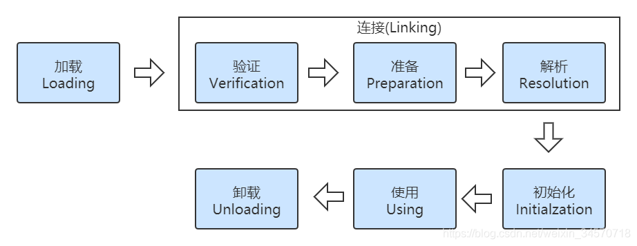
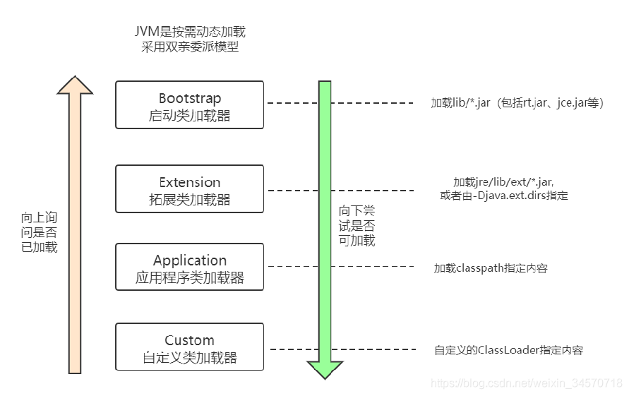
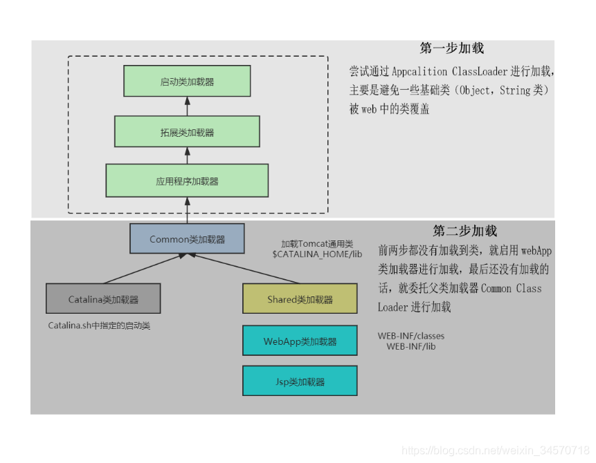
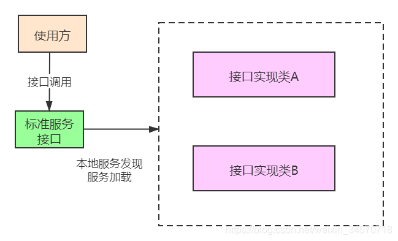

> # 类加载器以及双亲委派模型

### 一个类的生命周期（7个阶段）

**加载-验证-准备-解析-初始化-使用-卸载**


其中，类的加载过程是十分重要的过程。在这一过程，是由JVM提供的类加载器来完成。

### **类加载器**

JVM提供三层类加载器

**启动类加载器**：Bootstrap Class Loader ，是C++写的，返回为NULL（比如String类），lib/下的jar包，比如rt.jar,jce.jar等

**拓展类加载器**：Extension Class Loader，jre/lib/ext下的jar或者是指定的jar

**应用程序类加载器**：Application  Class Loader，加载calsspath指定内容

当然自己也可以定义加载器，不算入JVM中的，**自定义加载器**：Custom ClassLoader，自定义加载器，支持一些个性化的扩展功能

```xml
-Xbootclasspath
设置启动类加载器的路径
```

### **双亲委派模型**


每一层的类加载器都有上层的加载器，称为父类加载器，Bootstrap加载器最上层的类加载器，主要加载一些重要的类，如Object类，String类等。当类需要加载的时候子类加载器会依次向上委托父类加载器进行加载，并向上询问是否已经被加载，如果父类没有被加载，则向下尝试子类加载器是否可加载，直到该类被加载，过程结束。这就是双亲委派模型机制。

总结：**向上委托并询问，向下尝试加载**

优势：**稳定**，当自己重写了个基础类（Object类，String类等）进行加载的时候，子类加载器依次向上委托基础类给父类加载器，到了Bootstrap类加载器发现rt.jar中有，然后就直接加载，返回加载成功。这样保证了JVM运行的安全稳定。

**对于任意一个类，都需要由加载它的类加载器和这个类本身一同确立其在 Java 虚拟机中的唯一性，每一个类加载器，都拥有一个独立的类名称空间。**

#### **打破双亲委派模型的示例**
虽然双亲委派模型能够保证JVM稳定运行，但有些时候根据场景，我们需要打破这种机制。
##### 1.Tomca类加载机制




Tomcat中自定义的Common加载器：Catalina类+Shared类加载器

tomcat通过war包进行的应用发布，其实时违反了双亲委派机制原则。因为不同的项目可能用到不同版本的第三方，即需要不同webApp类加载器加载不同版本的第三方，需要隔离，所以要破坏双亲委派模型。

**tomcat的设计如何破坏了双亲委派机制？**

tomcat中存在三种类加载器，Common加载器：Catalina类+Shared类加载器，在进行类加载的时候是这样处理的：

1.首先判断这个类是否已经被加载了，如果被加载了就返回，否则下一步；

2.尝试通过Appcalition ClassLoader进行加载，主要是避免一些基础类（Object，String类）被web中的类覆盖，导致不安全，如果加载了就返回，否则下一步；

3.如果前两步都没有加载到类，就启用webApp类加载器进行加载，如果被加载了就返回，否则下一步；

4.最后还没有加载的话，就委托父类加载器Common ClassLoader进行加载。

**但是你自己写一个 ArrayList或者HashMap时候，放在应用目录里，tomcat 依然不会加载（会在第二步时通过Application类加载器进行加载）。Tomca类加载机制只是自定义的加载器顺序不同，但对于顶层来说，还是一样的。**

##### 2.**SPI**（Service Provider Infreface）

Java 中有一个 SPI 机制，全称是 Service Provider Interface，是 Java 提供的一套用来被第三方实现或者扩展的服务提供接口，设计模式：基于接口的编程，是接口+实现类+配置文件

其中最有代表性的，**JDBC，数据库连接**

**如何破环双亲委派？**

原本应该是通过BootStrap ClassLoader进行加载，没有代码进行实现加载，只能获取当前线程上下文加载器，即整个web的Application ClassLoder，所以最后其实在使用的Application类加载器加载


源码分析

```java
//我们在JDBC连接数据库的时候往往通过一行代码就能实现
//Class.forName("xx");可以不用写
Connection conn= DriverManager.getConnection(url, user, password);
//当getConnection被调用的时候，DriverManager中有个static静态代码块进行执行
	/**
     * Load the initial JDBC drivers by checking the System property
     * jdbc.properties and then use the {@code ServiceLoader} mechanism
     */
    static {
        loadInitialDrivers();
        println("JDBC DriverManager initialized");
    }
//静态代码块执行的方法loadInitialDrivers()
    private static void loadInitialDrivers() {
        String drivers;
        try {
            drivers = AccessController.doPrivileged(new PrivilegedAction<String>() {
                public String run() {
                    return System.getProperty("jdbc.drivers");
                }
            });
        } catch (Exception ex) {
            drivers = null;
        }
        // If the driver is packaged as a Service Provider, load it.
        // Get all the drivers through the classloader
        // exposed as a java.sql.Driver.class service.
        // ServiceLoader.load() replaces the sun.misc.Providers()

        AccessController.doPrivileged(new PrivilegedAction<Void>() {
            public Void run() {
				//注意这里！！！加载Driver.class代码
                ServiceLoader<Driver> loadedDrivers = ServiceLoader.load(Driver.class);
                Iterator<Driver> driversIterator = loadedDrivers.iterator();

                /* Load these drivers, so that they can be instantiated.
                 * It may be the case that the driver class may not be there
                 * i.e. there may be a packaged driver with the service class
                 * as implementation of java.sql.Driver but the actual class
                 * may be missing. In that case a java.util.ServiceConfigurationError
                 * will be thrown at runtime by the VM trying to locate
                 * and load the service.
                 *
                 * Adding a try catch block to catch those runtime errors
                 * if driver not available in classpath but it's
                 * packaged as service and that service is there in classpath.
                 */
                try{
                    while(driversIterator.hasNext()) {
                        driversIterator.next();
                    }
                } catch(Throwable t) {
                // Do nothing
                }
                return null;
            }
        });

        println("DriverManager.initialize: jdbc.drivers = " + drivers);

        if (drivers == null || drivers.equals("")) {
            return;
        }
        String[] driversList = drivers.split(":");
        println("number of Drivers:" + driversList.length);
        for (String aDriver : driversList) {
            try {
                println("DriverManager.Initialize: loading " + aDriver);
                Class.forName(aDriver, true,
                        ClassLoader.getSystemClassLoader());
            } catch (Exception ex) {
                println("DriverManager.Initialize: load failed: " + ex);
            }
        }
    }
//进入到ServiceLoader之后的代码
//能发现，这个加载时是获取当前线程的上下文类加载器进行加载，而这个加载器不是JVM中BootStrap类加载器，而是厂商提供的，所以加载的时候不是在BootStrap类加载器加载，在打破了双亲委派模型~
public static <S> ServiceLoader<S> load(Class<S> service) {
        ClassLoader cl = Thread.currentThread().getContextClassLoader();
        return ServiceLoader.load(service, cl);
    }

```
总结：通过源码不难看出，Class.forName("xx");能写且不报错，说明在JVM里面有这个Drive类的加载代码，但是只有接口，没有实现，具体实现是厂商提供的，而这个过程不遵循双亲委派机制。


> 对SPI想多点了解，可参考：
> https://mp.weixin.qq.com/s?__biz=MzIxNDY0MTg2MA==&mid=2247483935&idx=1&sn=e6da46cfe2df2812fd2b9e24253ec246&chksm=97a53fb4a0d2b6a2896b5c0850e83a7852ad08fbe0939bb61d04982bc0d03d3f6da25ee56dbf&scene=21#wechat_redirect


##### 3.**OSGi**——模块化（微服务）  安装、启动、停止、卸载。

原理：使类相互之间不可见，相当霸道！（后续补充）