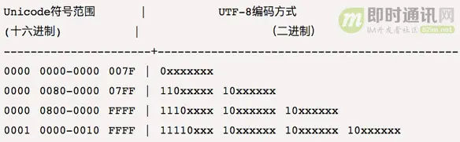

> # 详解各类的编码格式

# 一、 #ASCII 码
计算机内所有的信息都是二进制位。一个字节包含 8 个二进制位，可以表示 256 个状态，每个状态表示一个符号。
ASCII 码一共规定了128个字符的编码，比如空格 SPACE 是32（二进制00100000），大写的字母 A 是65（二进制01000001）。这128个符号（包括32个不能打印出来的控制符号）。ASCII 码只占用了一个字节的后面7位，最前面的一位统一规定为0。

# 二、非 ASCII 编码
英语用128个符号编码就够了，但是用来表示其他语言，128个符号是不够的。比如，在法语中，字母上方有注音符号，它就无法用 ASCII 码表示。于是，一些欧洲国家就决定，利用字节中闲置的最高位编入新的符号。比如，法语中的é的编码为130（二进制10000010）。这样一来，这些欧洲国家使用的编码体系，可以表示最多256个符号。
所有这些编码方式中，0-127表示的符号是一样的，不一样的只是128-255的这一段，不同的国家相同的 ASCII 码表示的可能是不同的符号。
至于亚洲国家的文字，使用的符号就更多了，汉字就多达10万左右。一个字节只能表示256种符号，肯定是不够的，就必须使用多个字节表达一个符号。比如，简体中文常见的编码方式是 GB2312 ，使用两个字节表示一个汉字，所以理论上最多可以表示 256 x 256 = 65536 个符号。
# 三、 #Unicode 字符集
将世界上多有文字都进行编码，就形成了 Unicode。Unicode 的规模可以容纳100多万个符号，每个符号的编码都不一样。比如，U+0639表示阿拉伯字母 Ain，U+0041表示英语的大写字母 A，U+4E25表示汉字严。
但是，Unicode 只是字符集，它之规定了符号的二进制代码，却不规定编码方式。比如：汉字严的 Unicode 是十六进制数4E25，转换成二进制数足足有15位（100111000100101），也就是说，这个符号的表示至少需要2个字节（16 位二进制数）。如果将 0 补全之后存储，计算机读取的时候，他不清楚到底是（01001110）+（00100101）两个 ASCII 码，还是 （100111000100101）单个 Unicode 值。那么就出现了其他的编码方式。
# 四、 #UTF-8 编码方式
UTF-8 就是在互联网上使用最广的一种 Unicode 的实现方式。其他实现方式还包括 UTF-16（字符用两个字节或四个字节表示）和 UTF-32（字符用四个字节表示），不过在互联网上基本不用。
UTF-8 最大的一个特点，就是它是一种变长的编码方式。它可以使用1~4个字节表示一个符号，根据不同的符号而变化字节长度。
**UTF-8 的编码规则很简单，只有二条：**
- 1）对于单字节的符号：字节的第一位设为0，后面7位为这个符号的 Unicode 码。因此对于英语字母，UTF-8 编码和 ASCII 码是相同的；
- 2）对于 n 字节的符号（n > 1）：第一个字节的前 n 位都设为 1，第 n + 1 位设为 0，后面字节的前两位一律设为 10。剩下的没有提及的二进制位，全部为这个符号的 Unicode 码。

<mark style="background: #FFB86CA6;">如果一个字节的第一位是0，则这个字节单独就是一个字符；如果第一位是1，则连续有多少个1，就表示当前字符占用多少个字节。</mark>
下面，还是以汉字严为例，演示如何实现 UTF-8 编码。
严的 Unicode 是4E25（100111000100101），根据上表，可以发现4E25处在第三行的范围内（0000 0800 - 0000 FFFF），因此严的 UTF-8 编码需要三个字节，即格式是1110xxxx 10xxxxxx 10xxxxxx。然后，从严的最后一个二进制位开始，依次从后向前填入格式中的 x，多出的位补0。这样就得到了，严的 UTF-8 编码是11100100 10111000 10100101，转换成十六进制就是 E4B8A5。
如果保存的编码模式不同，"严"对应的值不同：
- 1）ANSII：文件的编码就是两个字节 D1 CF，这正是严的 GB2312 编码，这也暗示 GB2312 是采用大头方式存储的。
- 2）Unicode：编码是四个字节 FF FE 25 4E，其中 FF FE 表明是小头方式存储，真正的编码是4E25。
- 3）Unicode big endian：编码是四个字节 FE FF 4E 25，其中 FE FF 表明是 大头方式 存储。
- 4）UTF-8：编码是六个字节 EF BB BF E4 B8 A5，前三个字节 EF BB BF 表示这是 UTF-8 编码，后三个 E4B8A5 就是严的具体编码，它的存储顺序与编码顺序是一致的。

# 五、GB 系列
## #GB2312 字符集
天朝专家把那些127号之后的奇异符号们（即 EASCII）取消掉，规定：一个小于127的字符的意义与原来相同，但两个大于127的字符连在一起时，就表示一个汉字，前面的一个字节（他称之为高字节）从0xA1用到 0xF7，后面一个字节（低字节）从0xA1到0xFE，这样我们就可以组合出大约7000多个简体汉字了。在这些编码里，还把数学符号、罗马希腊的字母、日文的假名们都编进去了，连在 ASCII 里本来就有的数字、标点、字母都统统重新编了两个字节长的编码，这就是常说的"全角"字符，而原来在127号以下的那些就叫"半角"字符了。这就是 GB2312， #GBK （即 CP936 字符集）和 #GB18030 是对 GB2312 的拓展。
## #GBK 编码方式
由于 GB 2312-80只收录6763个汉字，有不少汉字，如部分在 GB 2312-80推出以后才简化的汉字（如"啰"），部分人名用字（如中国前总理\*\*\*的"\*"字），台湾及香港使用的繁体字，日语及朝鲜语汉字等，并未有收录在内。于是厂商微软利用 GB 2312-80未使用的编码空间，收录 GB 13000.1-93全部字符制定了 GBK 编码。根据微软资料，GBK 是对 GB2312-80的扩展，也就是 CP936字符集 (Code Page 936)的扩展（之前 CP936和 GB 2312-80一模一样），最早实现于 Windows 95简体中文版。虽然 GBK 收录 GB 13000.1-93的全部字符，但编码方式并不相同。GBK 自身并非国家标准，只是曾由国家技术监督局标准化司、电子工业部科技与质量监督司公布为"技术规范指导性文件"。原始 GB13000一直未被业界采用，后续国家标准 #GB18030 技术上兼容 GBK 而非 GB13000。
## #GB18030 字符集
全称：国家标准 GB 18030-2005《信息技术中文编码字符集》，是中华人民共和国现时最新的内码字集，是 GB 18030-2000《信息技术信息交换用汉字编码字符集的扩充》的修订版。与 GB 2312-1980完全兼容，与 GBK 本兼容，支持 GB 13000及 Unicode 的全部统一汉字，共收录汉字70244个。

# 六、总结
## 字符集 ：
ASCII 字符集：常规的字符集，表示英文以及部分符号。
Unicode 字符集：表示世界上所有字符，统一的字符集。
GB2312 字符集：适配汉字，ASCII 字符集的中文拓展字符集。
CP936 字符集：GBK 编码方式使用的字符集，GB2312 的拓展表。
GB18030 字符集：GB2312 的拓展表，包含全部汉字。
#编码方式 ：
UTF-8 编码方式：是一种对 Unicode 字符集的编码方式，字符由不定字节长度表示。
UTF-16 编码方式：是一种对 Unicode 字符集的编码方式，字符用两个字节或四个字节表示。
UTF-32 编码方式：是一种对 Unicode 字符集的编码方式，字符用四个字节表示。
GBK 编码方式：使用CP936 编码表，是对 ASCII 表的中文适配。
`简单来说：Unicode、GBK 和 Big5码等就是编码的值（也就是术语“字符集”），而 UTF-8、UTF-16、UTF32之类就是这个值的表现形式（即术语“编码格式”）。`
另外：
`Unicode、GBK和Big5码等字符集是不兼容的，同一个汉字在这三个字符集里的码值是完全不一样的。如＂汉＂的Unicode值与gbk就是不一样的，假设Unicode为a040，GBK为b030。以UTF-8为例，UTF-8码完全只针对Unicode来组织的，如果GBK要转UTF-8必须先转Unicode码，再转UTF-8就OK了。`
即GBK、GB2312等与UTF8之间都必须通过Unicode编码才能相互转换：
> 1）GBK、GB2312 --先转--> Unicode --再转--> UTF8  
> 2）UTF8 --先转--> Unicode --再转--> GBK、GB2312

# 补充
## BIG5字符集&编码
Big5，又称为大五码或五大码，是使用繁体中文（正体中文）社区中最常用的电脑汉字字符集标准，共收录13,060个汉字。中文码分为内码及交换码两类，Big5属中文内码，知名的中文交换码有 CCCII、CNS11643。Big5虽普及于台湾、香港与澳门等繁体中文通行区，但长期以来并非当地的国家标准，而只是业界标准。倚天中文系统、Windows 等主要系统的字符集都是以 Big5准，但厂商又各自增加不同的造字与造字区，派生成多种不同版本。2003年，Big5被收录到 CNS11643中文标准交换码的附录当中，取得了较正式的地位。这个最新版本被称为 Big5-2003。
Big5码是一套双字节字符集，使用了双八码存储方法，以两个字节来安放一个字。第一个字节称为"高位字节"，第二个字节称为"低位字节"。"高位字节"使用了0x81-0xFE，"低位字节"使用了0x40-0x7E，及0xA1-0xFE。
## 大头方式、小头方式
上一节已经提到，UCS-2 格式可以存储 Unicode 码（码点不超过0xFFFF）。以汉字严为例，Unicode 码是4E25，需要用两个字节存储，一个字节是4E，另一个字节是25。存储的时候，4E 在前，25在后，这就是 Big endian 方式；25在前，4E 在后，这是 Little endian 方式。
第一个字节在前，就是"大头方式"（Big endian），第二个字节在前就是"小头方式"（Little endian）。
那么很自然的，就会出现一个问题：计算机怎么知道某一个文件到底采用哪一种方式编码？
Unicode 规范定义，每一个文件的最前面分别加入一个表示编码顺序的字符，这个字符的名字叫做"零宽度非换行空格"（zero width no-break space），用FEFF表示。这正好是两个字节，而且FF比FE大1。
如果一个文本文件的头两个字节是 FE FF，就表示该文件采用大头方式；如果头两个字节是 FF FE，就表示该文件采用小头方式。

参考资料：
>  [字符编码技术专题(一)：快速理解ASCII、Unicode、GBK和UTF-8]( https://zhuanlan.zhihu.com/p/658651404 )