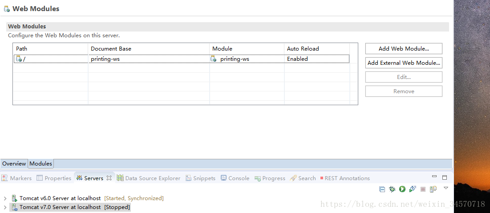

> #  项目调试图片资源不加载问题解决   

今天调试项目的时候，启动tomcat之后，在ie浏览器中输入地址http://localhost:8080/printing/login_unit.jsp后发现，页面能够加载出来，但是其中一些元素没有加载出来。

第一时间想到的是兼容性问题，所以就把localhost加入到ie的兼容性地址中。但是还是不行，该不显示还是不显示，这时候我发现，不显示的元素中很多都是图片没有加载，图片资源是放在项目中web文件夹下的子文件夹，应该说不可能加载不出来，除非是项目名称有问题，但是我的项目名就是叫做printing啊！！！！

等一下，我突然想到，可能在映射地址的时候并没有把printing加上，而是直接 http://IP:端口/页面 的形式，因而如果多输了printing相应的资源就找不到的！！！我就把Tomcat中设置改为不加printing，果然就成功了！

详细解决操作：

找到tomcat 双击点开设置属性，然后点下面的Modules 找到项目，把Path更改一下就行了！