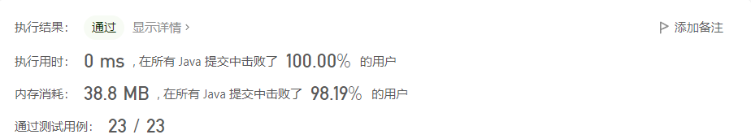
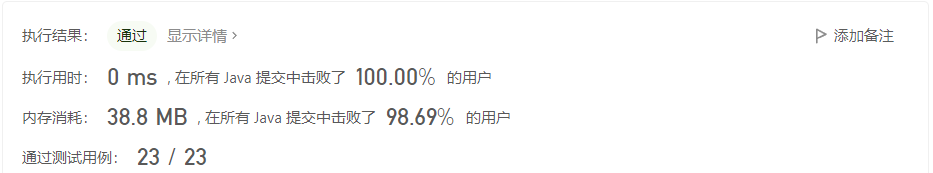

# 【力扣】面试题 01.02. 判定是否互为字符重排

**题目：** 面试题 01.02. 判定是否互为字符重排

**难度：** 简单

**提交时间：** 2022-9-27	


### 问题描述
给定两个字符串 s1 和 s2，请编写一个程序，确定其中一个字符串的字符重新排列后，能否变成另一个字符串。

```示例
示例 1：

输入: s1 = "abc", s2 = "bca"

输出: true 

示例 2：


输入: s1 = "abc", s2 = "bad"

输出: false

说明：

0 <= len(s1) <= 100

0 <= len(s2) <= 100
```
>来源：力扣（LeetCode）
>链接：https://leetcode.cn/problems/check-permutation-lcci
>著作权归领扣网络所有。商业转载请联系官方授权，非商业转载请注明出处。

### 解法

#### 方法一：排序比较

 **思路与算法** 


相对来说，排序比较的解题思路比较好理解:

首先，先判断这个两个字符串长度是否相同，不同则false;

如果这两个字段只有顺序不同的话，直接排序之后比较大小即可

**代码**

```java
class Solution {
    public boolean CheckPermutation(String s1, String s2) {
        if(s1.length()!=s2.length()){
            return false;
        }
        char[] c1 = s1.toCharArray();
        char[] c2 = s2.toCharArray();
        Arrays.sort(c1);
        Arrays.sort(c2);
        return Arrays.equals(c1,c2);

    }
}
```
**执行结果**



**复杂度分析**

- 时间复杂度：O($nlogn$)，排序的时间复杂度为O($nlogn$)，比较相等的时间为O(n)，最后O($nlogn+n$)=O($nlogn$);
- 空间复杂度：O($logn$)。排序需要 O($logn$) 的空间复杂度。注意，在某些语言（比如 Java & JavaScript）中字符串是不可变的，因此我们需要额外的 O(n)的空间来拷贝字符串。但是我们忽略这一复杂度分析，因为：
    - 这依赖于语言的细节;
    - 这取决于函数的设计方式，例如，可以将函数参数类型更改为 char[]。


#### 方法二：模拟，哈希表

 **思路与算法**

首先依然是，如果长度不对应的话，就返回false；

假设有一个表，来记录某个字符的出现个数，当s1中出现字符，则表中对应计数+1，当s2中出现该字符，则表中对应计数-1，如果出现某个计数是小于0的，则说明两个字符串不为字符串重排

>重点理解1：怎么设计表中对应计数？

这道题设计相对不太严谨，不过因为是简单题，所以力扣官方在测试用例中默认的字符都是小写字母，那么，我们可以用ASCII（tab[c-'a']）的差值表示表内位置；

如果严谨一点，包含大写字符，则（tab[c-'A'])的差值表示表内位置；

>重点理解2：为什么要某个计数小于0，则说明两个字符串不为互排？

两个字符串的情况只会有2种

1.  两个字符串完全互为重排，则表内对应位置计数都为0

2.  s1，s2存在差异字符,那么s2中的差异字符在s1计算时候没有+1，直接-1 那么< 0


**代码**

```java
class Solution {
    public boolean CheckPermutation(String s1, String s2) {
        if(s1.length()!=s2.length()){
            return false;
        }
        int[] tab = new int[128];
        char[] c1 = s1.toCharArray();
        char[] c2 = s2.toCharArray();
        for(char c : c1){
            ++tab[c-'a'];
        } 
        for(char c :c2){
            if(--tab[c-'a']<0){
                return false;
            }
        }
        return true;
    }
}
```
**执行结果**



**复杂性分析**
- 时间复杂度：O(n)，遍历字符串s1的长度n，所以时间复杂度为O(n)；
- 空间复杂度：O(S)，S代表生命的数组tab的长度。


### 总结

遇到乱序的问题，首先想到是否能够排序，排过序之后再去比较，这就是方法一的思路；除此之外，需要注意Arrays.sort()方法的时间复杂度为O($nlogn$)，空间复杂度为O($logn$)，Arrays.equals()的时间复杂度为O(n)，空间复杂度为O(n)；

方法二的哈希表是解决很多问题的关键，如何将问题转化成哈希表中的对应的值是解题的关键。


