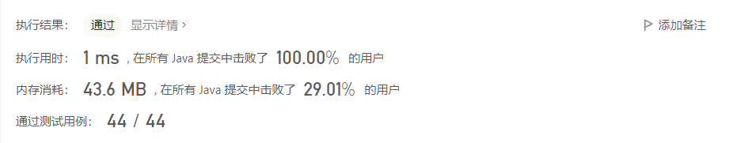

# 【力扣】面试题 17.19. 消失的两个数字

**题目：** 面试题 17.19. 消失的两个数字

**难度：** 困难

**提交时间：** 2022-09-26


### 问题描述

给定一个数组，包含从 1 到 N 所有的整数，但其中缺了两个数字。你能在 O(N) 时间内只用 O(1) 的空间找到它们吗？

以任意顺序返回这两个数字均可。
```示例
示例 1:

输入: [1]

输出: [2,3]

示例 2:

输入: [2,3]

输出: [1,4]

提示：

nums.length <= 30000
```

>来源：力扣（LeetCode）
>链接：https://leetcode.cn/problems/missing-two-lcci
>著作权归领扣网络所有。商业转载请联系官方授权，非商业转载请注明出处。


### 解法

#### 方法一：数学思维解决问题

 **思路与算法** 

用数学方法去解决这个问题，

1. 假设1...n没有缺失，则总和为sum = n * (n+1) / 2;

2. 实际总和可以通过遍历相加，得出的总和为cur，则缺失两个数的和mSum: mSum = sum-cur;

3. 算出两数的平均数avg = mSum / 2,两个缺失的数中有个数一定比avg小，设为x，则假设在1...avg中同一样假设没有缺失数，则总和为hSum = avg * (avg+1) /2;

4. 实际总和也可以通过遍历算出来，将所有比x小的数相加总和为hCur，则x=hSum-hCur;

5. 另一个数为 mSum-x;


>上述图解出自：https://leetcode.cn/problems/missing-two-lcci/solution/zhua-wa-mou-si-by-muse-77-pqe5/  如有侵权，请联系作者删除


**代码**

```java
class Solution {
    public int[] missingTwo(int[] nums) {
        int len = nums.length+2;
        int cur = len*(len+1)/2;
        for(int num : nums ){
            cur = cur - num;
        }
        int mSum = cur;
        int avg = sum/2;
        int hSum = avg*(avg+1)/2;
        for(int num : nums){
            if(num<=avg)
            hSum= hSum-num;
}       
            return new int[]{hSum,mSum-hSum} ;
    }
}
```

**执行结果**




### 总结

求缺失的两个数，是不是可以将这个数组在某处分成两部分，一部分缺失一个数的情况相对比较好计算，这就是用数学的思维来解决这个问题


### 深入研究

如果是缺失3个数，应该如何分析？


