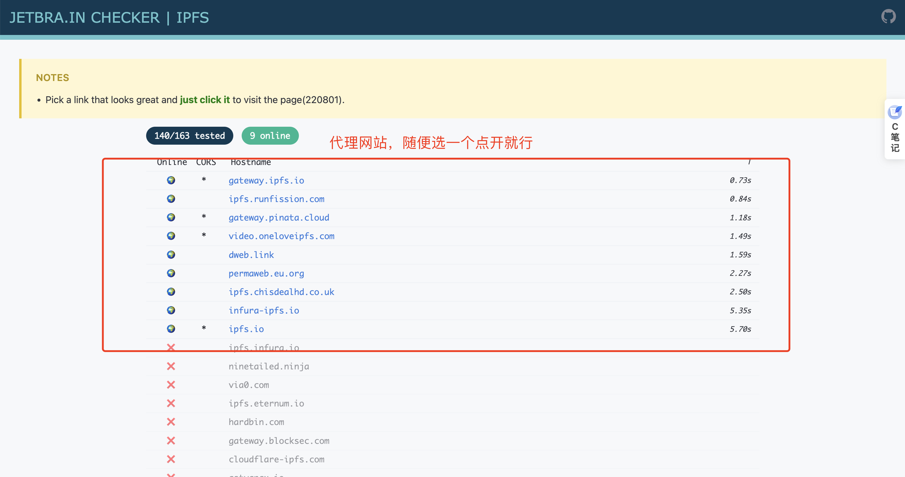
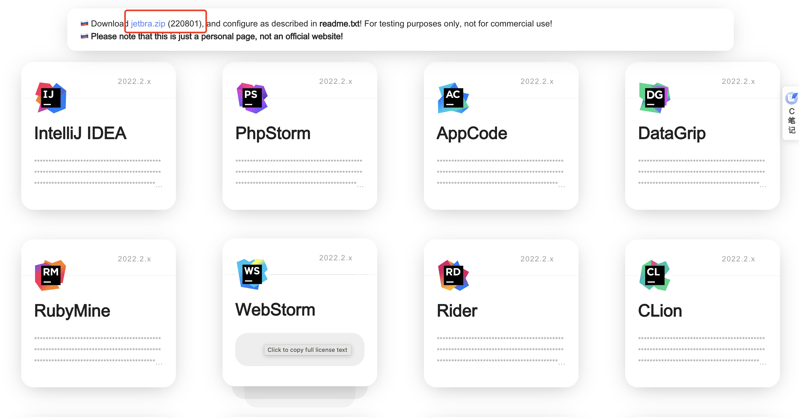
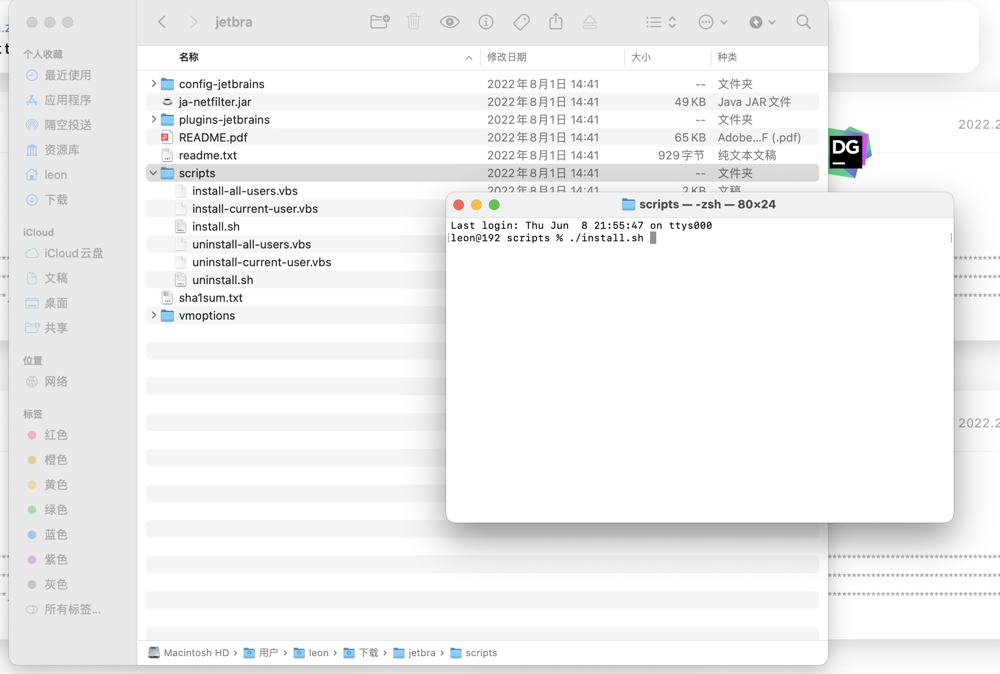
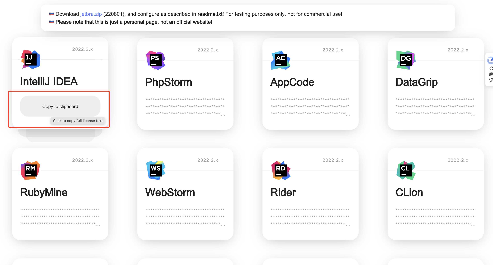
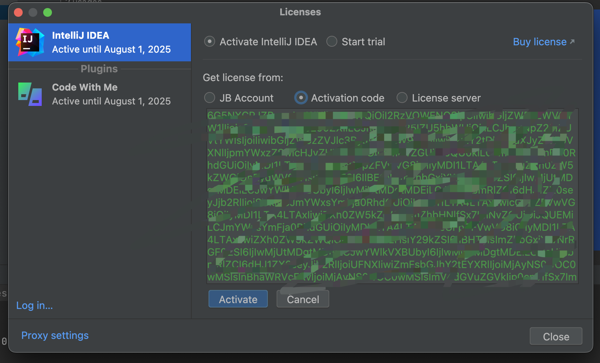

# 【IDEA】idea软件免费破解（仅供学习使用）

今天做项目的时候idea直接崩溃闪退了，然后怎么点都打不开。

尝试了多种方法之后发现之前弄的破解jar有问题了，然后先将idea.vmoptions文件中相关jar的指向删除掉，然后重新破解一次。

破解之前安装IDEA，这个直接从官网上下载即可。（我这边用的是2022.2.x版本，其他版本不清楚）

破解过程相当简单：

1. 首先访问这个网址   [idea网址](https://3.jetbra.in/ ) ，然后随便选一个点开就行（如果加载比较慢就换一个网站）。

2. 然后进入网站之后下载jetbra.zip包，解压之后执行script文件下的install.sh文件

3. 然后在刚才的网址上选择IDEA然后点击Copy to clipboard ,复制Activation code

4. 然后在IDEA中输入Activation code，Activate即可。

